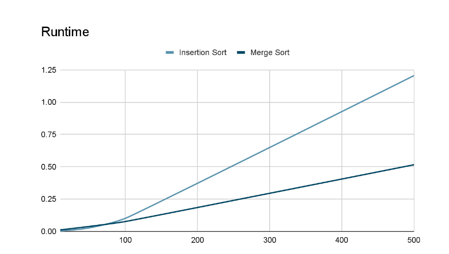

# Algorithms-Comparison

This program can be used to empirically compare two sorting algorithms, insertion sort, with a worst-case running time of O(n2), and merge sort, with worst-case running time of O(n log n). After measuring the runtimes of both algorithms, I compared my findings in the report with the worst-case running time of each to confirm my results.

The above image illustrates this, with the y axis representing runtime in ms, and the x axis represents the input size.
Insertion sort, an algorithm with O(n^2) runtime, is actually faster with small input sizes. 
Merge sort, a O(nlogn) algorithm, is actually slower than insertion sort although it has a better time complexity.
Although, as the input size increases, the physical runtime will diverge.

On top of measurements, the sorting algorithms were also implemented to sort objects. In person sorter, insertion sort was implemented to sort an array of Person objects by last name. Merge sort was likewise implemented to sort by date of birth.

Finally, quicksort was used to sort by last name and date of birth. This means it would arrage Person objects in lexicographic order. If they had the same last name, it would them be followed by sorting them by date of birth.

